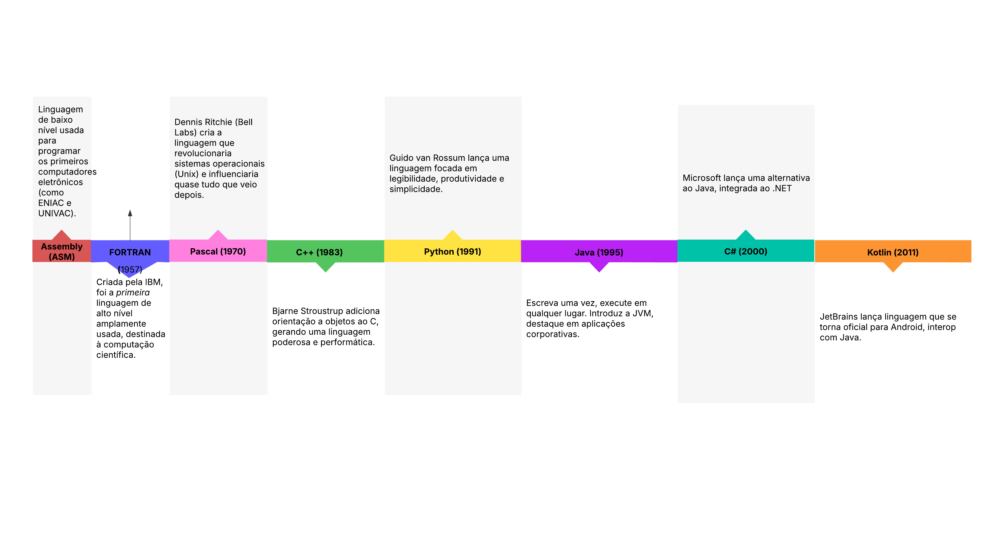

# Introdução às Linguagens de Programação

As linguagens de programação são o meio pelo qual humanos instruem computadores a executar tarefas. Desde os primórdios dos primeiros computadores eletrônicos até as linguagens modernas, houve uma evolução notável — tanto na forma quanto na abstração que oferecemos ao programador.

Este repositório apresenta uma linha do tempo ilustrada com os principais marcos históricos no desenvolvimento das linguagens de programação, destacando aquelas que contribuíram significativamente para mudanças de paradigma, popularização da computação ou transformação da indústria.

---

## Objetivo

- Compreender como e por que as linguagens surgiram e evoluíram.
- Relacionar os momentos históricos com os paradigmas de programação.
- Servir como material didático introdutório para disciplinas como *Introdução às Linguagens* ou *Paradigmas de Linguagens de Programação*.

---

## Linha do tempo destacada

| Ano       | Linguagem     | Destaque |
|----------|---------------|---------|
| 1940s    | **Assembly (ASM)** | Programação de baixo nível nos primeiros computadores (ENIAC/UNIVAC). |
| 1957     | **FORTRAN** | Primeira linguagem de alto nível — computação científica. |
| 1970     | **Pascal** | Ensino de programação estruturada. |
| 1983     | **C++** | C + Orientação a Objetos — alto desempenho com abstração. |
| 1991     | **Python** | Legibilidade e produtividade. |
| 1995     | **Java** | “Write once, run anywhere” com a JVM. |
| 2000     | **C#** | Alternativa Microsoft ao Java. |
| 2011     | **Kotlin** | Foco em concisão e interoperabilidade Java, dominante no Android. |

>  

---

## Conteúdo sugerido para estudo

### Conceitos Fundamentais

- O que é uma linguagem de programação?
- Tradução de código: compiladores vs interpretadores
- Paradigmas: imperativo, funcional, orientado a objetos, lógico
- Linha histórica da evolução tecnológica: hardware vs software

### Materiais de Apoio

- Livro: **“Paradigmas de Linguagens de Programação”** — Maurício Aniche  
- Livro: **“Structure and Interpretation of Computer Programs (SICP)”** — Abelson & Sussman  
- Artigo: **“History of Programming Languages”** — ACM  
- Vídeo-aula: *"Como surgiram as linguagens de programação?"* — Canal Curso em Vídeo (YouTube)

---

