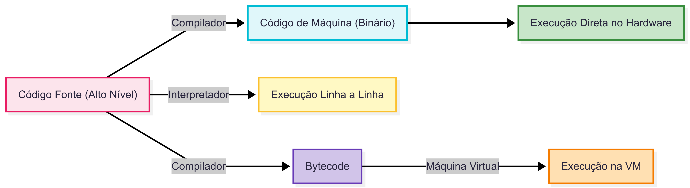

# Ambientes de Programação

Este documento apresenta um resumo sobre **compiladores**, **interpretadores** e **máquinas virtuais**, assim como um diagrama explicativo.

---

## Conceitos Principais

### 1. Compilador
- **O que faz?**  
  Traduz todo o código fonte (linguagem de alto nível) para código de máquina ou bytecode antes da execução.
- **Vantagens:**  
  - Execução mais rápida (código já está traduzido).
  - Detecção de erros em tempo de compilação.
- **Exemplos de linguagens:**  
  - C, C++, Rust, Go.

---

### 2. Interpretador
- **O que faz?**  
  Lê e executa o código fonte linha por linha, sem gerar um executável previamente.
- **Vantagens:**  
  - Mais flexível para testes e prototipagem.
  - Não precisa de um processo de compilação completo.
- **Exemplos de linguagens:**  
  - Python, JavaScript (em modo interpretado), Ruby.

---

### 3. Máquina Virtual (VM)
- **O que faz?**  
  Executa um código intermediário (bytecode), fornecendo um ambiente virtual entre o código e o hardware.
- **Vantagens:**  
  - Portabilidade (o mesmo bytecode pode rodar em diferentes sistemas operacionais).
  - Camada extra de segurança e gerenciamento de memória.
- **Exemplos de linguagens:**  
  - Java (JVM), C# (CLR/.NET), Kotlin (JVM).

---

