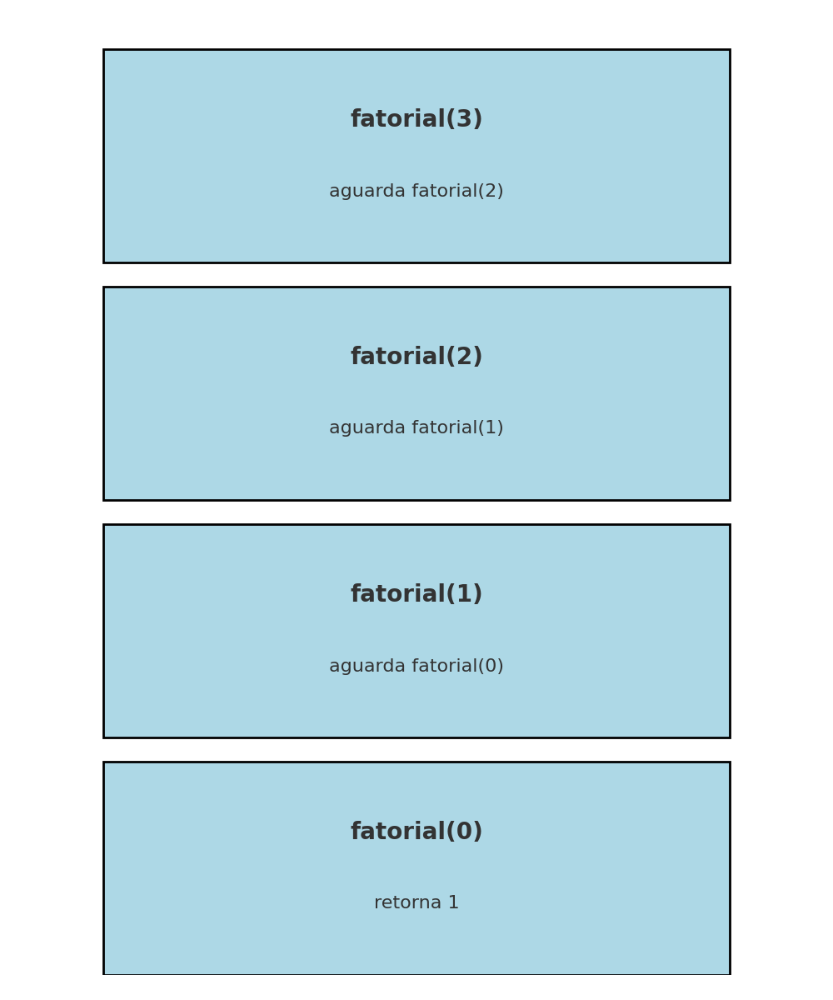

# Implementação de Subprogramas: Pilha de Chamadas

Este diretório apresenta a **implementação de subprogramas recursivos** e uma explicação visual sobre como funciona a **pilha de chamadas** (call stack).

---

## Exemplo Recursivo: Fatorial

A função fatorial é um ótimo exemplo de recursão, pois ela chama a si mesma até atingir o caso base.

```python
def fatorial(n):
    if n == 0:
        return 1
    else:
        return n * fatorial(n - 1)

print(fatorial(3))
```

---

## Pilha de Chamadas para fatorial(3)

```
|--------------------------|
| fatorial(0) retorna 1    | ← caso base
|--------------------------|
| fatorial(1) = 1 * 1 = 1  |
|--------------------------|
| fatorial(2) = 2 * 1 = 2  |
|--------------------------|
| fatorial(3) = 3 * 2 = 6  |
|--------------------------|
```

Cada chamada é empilhada até atingir o caso base. Depois, a pilha começa a ser **desempilhada**, e os resultados são computados na volta.

---

## Como funciona a pilha?

1. `fatorial(3)` chama `fatorial(2)` e fica aguardando o resultado.
2. `fatorial(2)` chama `fatorial(1)`.
3. `fatorial(1)` chama `fatorial(0)`.
4. `fatorial(0)` retorna 1.
5. Agora, os valores começam a ser multiplicados e retornados sucessivamente.

---

## Arquivo incluído

- 
Desenho da pilha de chamadas.
