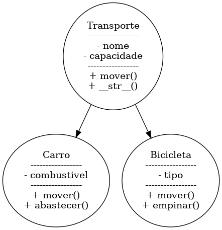

# Projeto - Exemplo de Programação Orientada a Objetos (POO)

Este projeto apresenta um exemplo simples de modelagem de classes usando POO em Python.

## Domínio escolhido
**Transportes**

## Objetivo do projeto
Demonstrar conceitos básicos de Programação Orientada a Objetos:
- Criação de classes e objetos
- Uso de herança
- Polimorfismo (sobrescrita de métodos)
- Encapsulamento simples (atributos e métodos)

## Hierarquia de classes

```
Transporte (classe base)
├── Carro
└── Bicicleta
```

## Descrição das classes

### Classe Transporte
- **Atributos**: `nome`, `capacidade`
- **Métodos**:
  - `mover()`: ação genérica para qualquer transporte

### Classe Carro (subclasse)
- **Atributos adicionais**: `combustivel`
- **Métodos adicionais**:
  - `mover()`: sobrescreve comportamento (dirigir)
  - `abastecer()`: comportamento específico

### Classe Bicicleta (subclasse)
- **Atributos adicionais**: `tipo`
- **Métodos adicionais**:
  - `mover()`: sobrescreve comportamento (pedalar)
  - `empinar()`: comportamento específico

## Como executar
1. Certifique-se de ter o Python 3 instalado.
2. Execute o arquivo `main.py`:

```bash
python main.py
```

## Saída esperada
Ao executar o programa, você verá a criação de objetos `Carro` e `Bicicleta`, com chamadas a seus métodos, demonstrando a herança e polimorfismo.

## Conceitos abordados
- **Herança:** Classes filhas (Carro, Bicicleta) herdando de Transporte.
- **Polimorfismo:** Método `mover()` comporta-se diferente dependendo da classe.
- **Composição:** Objetos instanciados a partir das classes.


